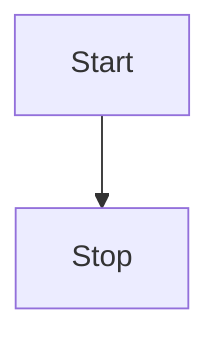
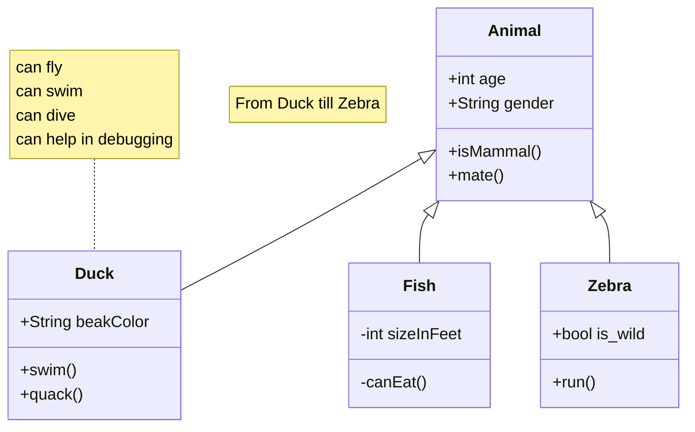

---
title: "meimaid"
date: 2026-03-18
draft: false
tags: ["mermaid", "diagram", "markdown"]
summary: "mermaid."
---

# mermaid 

usful tool for diagrams

https://mermaid.js.org/syntax/flowchart.html

## flowChart(activity diagram)

## classDiagram

