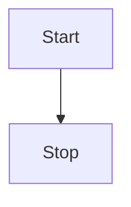
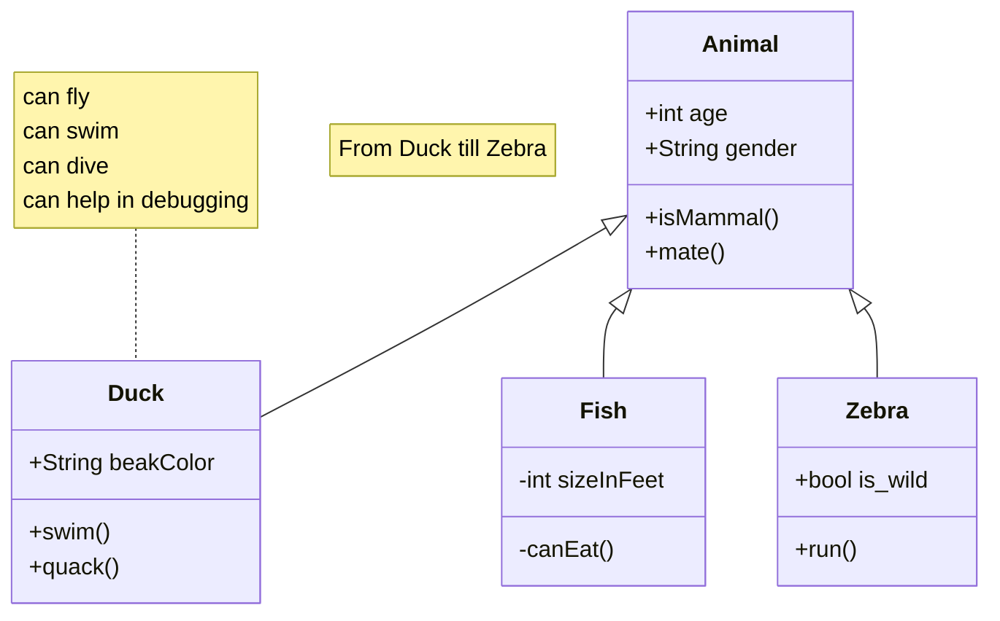

Mermaid is useful for creating diagrams directly in Markdown. See the [Mermaid flowchart documentation](https://mermaid.js.org/syntax/flowchart.html).

## Flowchart

```mermaid
flowchart TD
Start --> Stop
```

## Class diagram

```mermaid
classDiagram
    note "From Duck till Zebra"
    Animal <|-- Duck
    note for Duck "can fly<br>can swim<br>can dive<br>can help in debugging"
    Animal <|-- Fish
    Animal <|-- Zebra
    Animal : +int age
    Animal : +String gender
    Animal: +isMammal()
    Animal: +mate()
    class Duck{
        +String beakColor
        +swim()
        +quack()
    }
    class Fish{
        -int sizeInFeet
        -canEat()
    }
    class Zebra{
        +bool is_wild
        +run()
    }
```

